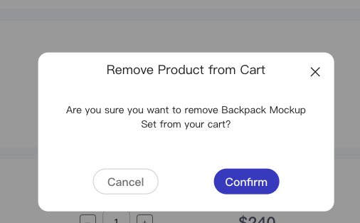

# Message is vue2

效果：



用法：
import Message from "/index.vue"

// vue 引入

```vue
<Message v-show="Solt_Message_Delete" @closeb="closeb" @Confirms="Confirms">
<template v-slot:title>
  <span>Delete Moodboard</span>
</template>
<template v-slot:content>
  Are you sure you want to remove Backpack Mockup Set from your cart?
</template>
<template v-slot:Cancel>
  Cancel
</template>

<template v-slot:Confirm>
  Confirm
</template>
</Message>
```

## API

- Solt_Message_Delete 控制弹窗的现实和隐藏
- closeb 关闭方法，需要手动控制 Solt_Message_Delete，以及你关闭时需要出发的操作
- Confirms 删除方法，需要手动控制 Solt_Message_Delete，以及你删除时需要出发的操作

vue

- v-slot:title 指定现实的标题
- v-slot:content 指定显示的内容
- v-slot:Cancel 指定返回按钮的文本
- v-slot:Confirm 指定确认按钮的文本
